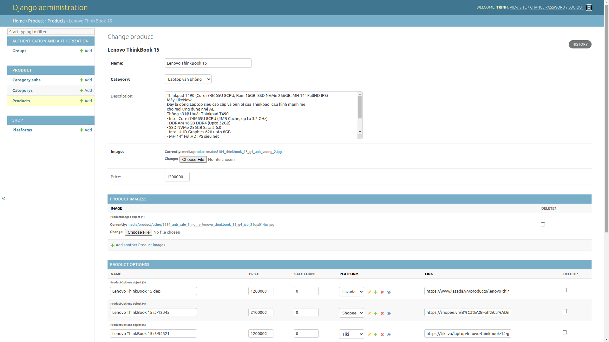

# Metric djano app

## yêu cầu

- python 3.10.8 
- postgresql
- redis (bổ sung)

## chạy ứng 
(yêu cầu cài redis trước)

```
python3 -m venv venv
source venv/bin/activate
pip install -r requirements.txt

python code/manage.py runserver
```

## Tính năng admin
- truy cập localhost:8000/admin/


